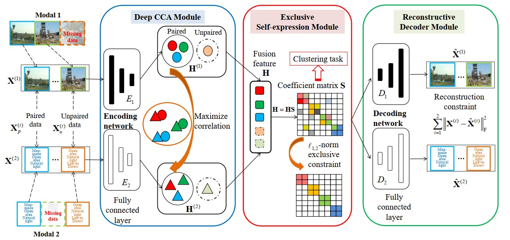
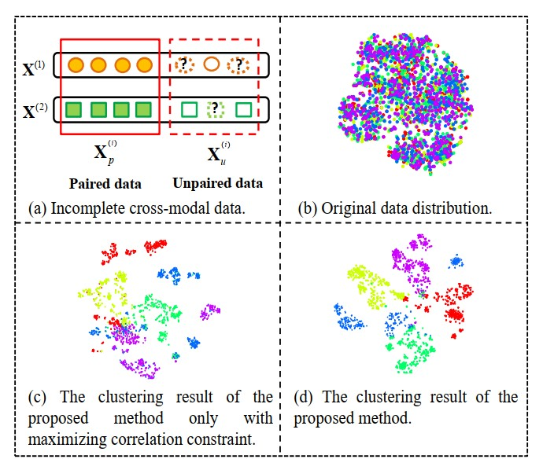

#iCmSC: Incomplete Cross-modal Subspace Clustering#


This repo contains the source code and dataset for our TIP 2021 paper:  
###Qianqian Wang, Huanhuan Lian, Gan Sun, Quanxue Gao, Licheng Jiao, iCmSC: Incomplete Cross-modal Subspace Clustering, IEEE TIP, 30: 305-317 (2021).###

[Paper Link](https://ieeexplore.ieee.org/abstract/document/9259207)

**Bibtex**

@article{wang2020icmsc,  
  title={iCmSC: Incomplete Cross-Modal Subspace Clustering},  
  author={Wang, Qianqian and Lian, Huanhuan and Sun, Gan and Gao, Quanxue and Jiao, Licheng},  
  journal={IEEE Transactions on Image Processing},  
  volume={30},  
  pages={305--317},  
  year={2020},  
  publisher={IEEE}  
}  

**iCmSC Model:**  

<div style="text-align: center; width: 900px; border: green solid 1px;">

<br></br>
<center></center>
</div>

**Introduction:**  

Cross-modal clustering aims to cluster the high-similar cross-modal data into one group while separating the dissimilar data. Despite the promising cross-modal methods have developed in recent years, existing state-of-the-arts cannot effectively capture the correlations between cross-modal data when encountering with incomplete cross-modal data, which can gravely degrade the clustering performance. To well tackle the above scenario, we propose a novel incomplete cross-modal clustering method that integrates canonical correlation analysis and exclusive representation, named incomplete Cross-modal Subspace Clustering (i.e., iCmSC). To learn a consistent subspace representation among incomplete cross-modal data, we maximize the intrinsic correlations among different modalities by deep canonical correlation analysis (DCCA), while an exclusive self-expression layer is proposed after the output layers of DCCA. We exploit a L1,2-norm regularization in the learned subspace to make the learned representation more discriminative, which makes samples between different clusters mutually exclusive and samples among the same cluster attractive to each other. Meanwhile, the decoding networks are employed to reconstruct the feature representation, and further preserve the structural information among the original cross-modal data. To the end, we demonstrate the effectiveness of the proposed iCmSC via extensive experiments, which can justify that iCmSC achieves consistently large improvement compared with the state-of-the-arts.

<div style="text-align: center; width: 900px; border: green solid 1px;">

<br></br>
<center></center>
</div>


**Dataset:**  

Cross-modal datasets: MNIST-2 with is a very classic digital image dataset from 0 to 9 in the field of machine learning. In MNIST-2, there are 60,000 handwritten digits image examples for training and 10,000 handwritten digits image examples for testing. The size of each image is 28 \times 28 pixels. We randomly choose 4,000 samples from 70,000 samples in order to facilitate experiments with the comparison algorithms that are not feasible to be applied on large scale datasets. We take the original images and the corresponding edge images as two modalities. BDGP dataset consists of images and text modalities. There are 5 categories of drosophila embryo images. Each of the 2,500 images in BDGP is represented by a 79 \times 1 textual feature vector and a 1,750 \times 1 visual feature vector. We use all these images in our experiment to evaluate the performance on both the two features. HW is a handwriting digital dataset from 0 to 9 for 10 classes containing 2000 samples. There are 6 public features: 216 profile correlations (FAC), 240 pixel averages in 2 \times 3 windows (PIX), 47 Zernike moment (ZER), 76 Fourier coefficients of the character shapes (FOU), 64 Karhunen-love coefficients (KAR) and 6 morphological (MOR) features. In our experiment, the 76 Fourier coefficients and $216$ profile correlations} are selected as two modalities.


**Requirements**

Python 3.6  
PyTorch 1.0  

**Train the model**  

```
python train.py
```


